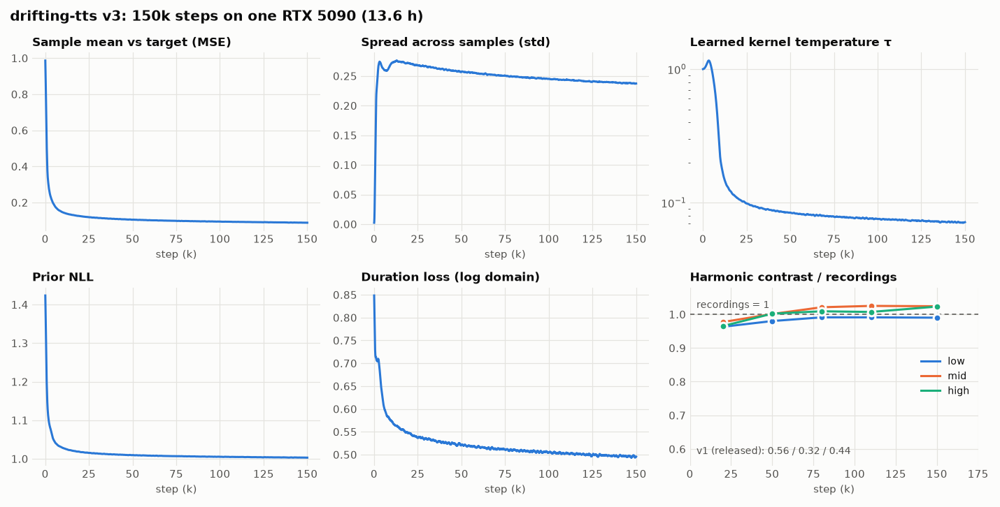

# Results

Detailed results of the current model, v3.1: the v3 model plus the fine-tuned `studio` voice. The
[README](../README.md) has the summary.

## Freya-TR-Eval

The FreyaTTS report's benchmark (arXiv 2607.09530):
- 495 everyday Turkish sentences;
- audio downsampled to 8 kHz;
- Whisper large-v3 (beam 5);
- the same normalisation on both sides.

The model uses T = 0.3 and α = 2, both chosen on a held-out dev split. Nothing was tuned on Freya. Piper and MMS-TTS
were re-run in this harness to check that it matches the report's.

| system | parameters | WER [95% CI] | CER [95% CI] | UTMOSv2 (full band) |
|---|---|---|---|---|
| **drifting-tts v3.1, studio voice** | 67.7 M + 112.4 M vocoder | **1.23%** [0.82, 1.68] | **0.24%** [0.16, 0.33] | **2.94** |
| drifting-tts v3.1, male voice | 67.7 M + 112.4 M vocoder | 1.74% [1.24, 2.30] | 0.38% [0.25, 0.53] | 2.81 |
| drifting-tts v3.1, female voice | 67.7 M + 112.4 M vocoder | 3.02% [2.38, 3.71] | 0.70% [0.54, 0.87] | 2.75 |
| Piper (tr_TR-dfki-medium), this harness | 16 M | 3.76% [3.06, 4.47] | 0.83% | – |
| MMS-TTS (`facebook/mms-tts-tur`), this harness | 36 M | 6.26% [5.42, 7.15] | 1.43% | – |
| Piper, FreyaTTS report | 16 M | 4.4% | 1.1% | – |
| MMS-TTS, FreyaTTS report | 36 M | 6.8% | 1.7% | – |
| FreyaTTS, FreyaTTS report | 183.2 M | 8.0% | 3.0% | – |
| F5-TTS (tr), FreyaTTS report | 336 M | 24.3% | 10.9% | – |
| XTTS-v2, FreyaTTS report | 470 M | 11.1% | 3.9% | – |

The FreyaTTS report puts real human recordings (FLEURS-tr) at 9.7% WER under this pipeline. Its MOS column comes
from a listening study, so it is not comparable with UTMOSv2.

## Voices

| voice | speaker ID | median pitch | Freya WER | UTMOSv2 (Freya) | duration factor |
|---|---|---|---|---|---|
| `studio` (default) | 722 | 103 Hz | **1.23%** | **2.94** | 0.935 |
| `male` | 389 | 104 Hz | 1.74% | 2.81 | 1.150 |
| `female` | 323 | 174 Hz | 3.02% | 2.75 | 1.194 |

- **Selection:** `male` and `female` were picked by measurement among the best-covered training speakers.
  `scripts/select_voices.py` scored each candidate on 30 held-out dev sentences with UTMOSv2 and Whisper CER.
- **`studio`:** added by fine-tuning (next section).
- **All speaker IDs:** [SPEAKERS.md](SPEAKERS.md) scores every one of the 723 IDs on 50 Freya sentences.
- **Duration factors:** each voice has its own factor from `calibrate-durations`. A single global factor had made
  some voices speak 7–17% faster than their recordings.

## Adding the studio voice (v3 → v3.1)

v3 was fine-tuned on its training corpus merged with recordings of one new studio voice, using
`configs/tts_v3_add_voice.yaml`:
- 30k steps at LR 1e-4, 2.7 h on an RTX 5090;
- the new voice made up about 40% of the batches;
- the learned kernel temperature was resumed from v3.

On 100 held-out recordings of the new voice:

| system | CER | WER | speaker sim. | UTMOSv2 |
|---|---|---|---|---|
| recording | 0.88% | 2.06% | – | 3.09 |
| recording → BigVGAN-v2 | 0.94% | 2.17% | 0.979 | 3.17 |
| v3.1, studio voice | **0.44%** | **1.98%** | 0.924 | 2.87 |

The existing voices kept their quality. Their Freya WER went from 1.92% to 1.74% (male) and from 3.78% to 3.02%
(female); part of that gain comes from the per-voice duration factors.

## Latency and size

**Setup:** RTX 5090, PyTorch 2.11, fp32, T = 0.3, α = 2, fine-tuned BigVGAN-v2. Each value is the median of 100 runs
after warm-up, measured with `scripts/bench_ttfa.py`.

**TTFA** (time to first audio) runs from the input text to the first sentence's waveform on the host. Synthesis
streams sentence by sentence, so later sentences are generated while the first one plays.

| input | first audio | TTFA | TTFA, BigVGAN CUDA kernel (`--cuda-kernel`) |
|---|---|---|---|
| short sentence ("Merhaba, nasılsınız?") | 1.6 s | 27.1 ms | **22.7 ms** |
| one long sentence | 7.8 s | 67.6 ms | **45.8 ms** |
| 4-sentence paragraph (21.7 s in total) | 5.2 s | 50.3 ms | **35.9 ms** |

- **Breakdown:** the text frontend takes 0.1 ms and the acoustic model (text encoder + one DriftDiT pass) about
  10 ms for any sentence length. The rest is the vocoder, which grows with the length of the first sentence.
- **Whole paragraph:** 148 ms for 21.7 s of audio (RTF 0.007). p90 latencies are within 0.5 ms of the medians.
- **Cold start:** the first call after loading takes about 0.3 s (CUDA / cuDNN initialisation).

| component | parameters |
|---|---|
| text encoder (with duration predictor) | 7.24 M |
| pitch predictor + pitch embedding | 0.40 M |
| DriftDiT generator | 60.05 M |
| **acoustic model** | **67.69 M** |
| BigVGAN-v2 vocoder (inference) | 112.41 M |
| **total at inference** | **180.10 M** |

The 2-D Mel-MAE feature encoder (4.4 M) is used only during training.

## In the browser (WebGPU)

`scripts/export_onnx.py` exports three graphs: the text encoder, the generator and the vocoder. Between them,
JavaScript repeats each token's features for its predicted duration. Each graph matches PyTorch to a relative error
below 4e-5. The whole JavaScript pipeline in `web/tts.js` was also run under onnxruntime-node with the noise of a
PyTorch run. Its text normalisation, token IDs and frame counts were identical, and the audio matched at an SNR of
80–84 dB.

The fp16 copies (`*_fp16.onnx`) store the weights in half precision and compute in fp32. BigVGAN's anti-aliasing
filters stay in fp32. The web demo loads the fp32 text encoder and the fp16 generator and vocoder: the text encoder is
small, yet it accounts for most of the rounding error.

| graphs | download | audio vs PyTorch |
|---|---|---|
| all fp32 | 729 MB | SNR 91 dB |
| web demo: fp32 text encoder, fp16-weight generator and vocoder | 385 MB | SNR 44–47 dB, log-spectral distance 0.6 dB |
| all with fp16 weights | 369 MB | SNR 38–43 dB |

**Setup:** RTX 5090, headless Chrome 153, onnxruntime-web 1.30 WebGPU, the web demo's graphs. Each value is a single
run after the warm-up pass:

| input | audio | first audio | total | acoustic model | vocoder |
|---|---|---|---|---|---|
| "Merhaba, nasılsınız? Bugün hava çok güzel." (2 sentences) | 2.9 s | 185 ms | 303 ms | 156 ms | 138 ms |
| 2-sentence train announcement (female voice) | 7.8 s | 373 ms | 600 ms | 168 ms | 429 ms |
| one sentence | 3.7 s | 289 ms | 290 ms | 89 ms | 200 ms |

- **Download:** loading the 385 MB of graphs from the Hub took about 11 s here, plus under 1 s of warm-up for
  shader compilation. Later visits load the graphs from the browser cache.
- **Intelligibility:** Whisper large-v3 transcribed all three browser outputs with 0% CER.
- **Other devices:** laptop and integrated GPUs will be slower. Without WebGPU the page falls back to WASM on the
  CPU, which is far slower than real time.

## MLX

`drifting_tts.mlx` is a port of the inference model to MLX for Apple silicon: the text encoder, the pitch and duration
predictors, DriftDiT and BigVGAN-v2. In BigVGAN, the anti-aliased activations are written in polyphase form and the
transposed convolutions as strided phases, so nothing is interleaved or zero-inserted. Every part was checked against
PyTorch with MLX 0.32 on Linux (CPU backend):

| check | result |
|---|---|
| acoustic model, same token ids and noise (real checkpoint) | identical frame counts, mel relative error ≤ 1.4e-5 |
| BigVGAN-v2, fp32 weights (real fine-tuned checkpoint) | SNR 98.9 dB |
| BigVGAN-v2, published weights (fp16, snake parameters fp32) | SNR 59.1 dB |
| whole pipeline, published weights, same noise as a PyTorch run | identical sample count, SNR 59.9 dB |
| Whisper large-v3 on two MLX outputs | 0% CER |

The published weights (`mlx/` in the model repo, 496 MB) keep the acoustic model in fp32. Storing it in fp16 as well
lowered the end-to-end SNR to 31.9 dB. The older Linux CPU results above establish numerical parity; the Apple GPU
measurements below were performed separately.

### Apple M2 Pro, 7 October 2026

Apple M2 Pro, 16 GB, macOS 26.5.2; Python 3.11.15, MLX/MLX Metal 0.32.3, NumPy 2.4.6. Published MLX weights at
Hugging Face revision `2de3308045f6f559b2efa2d8cca3749fa3262848`; float32 compute, studio voice, temperature 0.3,
CFG 2. Each input had two warmups followed by ten measurements (seeds 0–9). Separate processes, GPU device,
256 MiB unused allocator cache limit for **both** implementations. No playback, networking or download latency.

| input | original API TTFA p50 / p95 | streaming TTFA p50 / p95 | original total p50 | streaming total p50 |
|---|---|---|---|---|
| short sentence | 150.2 / 163.7 ms | 83.7 / 87.3 ms | 150.5 ms | 242.0 ms |
| long sentence | 701.2 / 709.3 ms | 97.1 / 102.4 ms | 701.2 ms | 991.0 ms |
| 4-sentence paragraph | 2072.5 / 2131.5 ms | 95.5 / 97.9 ms | 2072.6 ms | 3040.0 ms |

The baseline is the unmodified public MLX API at `17c85cff2a0604988f532add8a8e0d13bdae9d87`, which returns the
**complete waveform**. The updated streaming API returns **256 ms of PCM** first, then grows from 128 to 256 to a
maximum of 512 mel frames per chunk. These are caller-visible TTFA measurements; the old API has no streaming
consumer boundary. The improvement is 1.8× / 7.2× / 21.7× in first-delivery latency, not in total computation.
Repeated context increases total generation cost: streaming RTF is 0.165–0.184, versus about 0.115–0.117 for the
original buffered API. All measured warm streaming runs had zero calculated playback deficit.

The first request in the controlled processes (short input, weights already materialized) took 197.4 ms original
and 110.8 ms streaming. Weight loading was 57 ms and 142 ms respectively. These values are **process-cold**, not
machine-cold: the OS and Metal caches were already populated by previous work. An initial exploratory run before
the cache cap showed much larger variability. Full graph compilation remains opt-in because first-use and unseen
shape compilation can cost seconds; see [MLX usage and caveats](MLX.md).

With `--compile`, a separate five-run warm measurement (two warmups per input, otherwise the same settings) gave
TTFA p50 **70.8 / 79.4 / 77.3 ms** and total generation p50 **198.2 / 832.0 / 2506.9 ms** for the same three inputs.
Its TTFA p95 was 72.7 / 81.9 / 80.8 ms, with zero playback deficit. This optional configuration is suitable when
shapes are warmed before serving; it does not promise these times for unseen text lengths.

Three real checkpoint outputs (short, long and paragraph, seed 0) matched the original waveform exactly after
concatenating streamed chunks: identical sample counts and maximum absolute sample difference 0.0 on this machine.
The optional compiled mode retained identical sample counts with SNR 86.3–91.2 dB versus the original, reflecting
small float32 arithmetic differences (maximum absolute sample error 0.000186).
All three named voices were synthesized successfully in an MLX-only environment with no PyTorch installed.
This is numerical/output validation, not a new listening study or a rerun of the full Freya/Whisper benchmark.

The full Mac test suite finished with **382 passed, 5 skipped** (Ruff also passed). It covers PyTorch CPU training
smoke tests, MLX/PyTorch numerical parity, chunk boundaries,
seed stability, compilation, and public streaming behavior. Two CUDA tests require NVIDIA hardware; optional
jiwer and two uncached upstream weight tests are reported as skips. The JavaScript frontend passed 9,394 checks.
Run `python scripts/bench_mlx_ttfa.py` for raw measurements and provenance; see [MLX.md](MLX.md) for the exact API
and benchmark options.

## Spectral detail

The first version (v1) sounded muffled. Its harmonic peaks and valleys along frequency were only 32–56% as deep as
in the recordings. `evaluate --harmonic` measures this on 100 dev sentences, under the ground-truth alignment and
pitch, as a generated / recorded ratio:

| | low band | mid band (≈ 1.2–4.5 kHz) | high band |
|---|---|---|---|
| v1 | 0.56 | 0.32 | 0.44 |
| v3, T = 0.5 | 0.99 | 1.02 | 1.02 |

## Training

- **Run:** 150k steps in 13.6 h at 3.08 it/s (bf16, compiled generator). Each step uses 16 utterances × 16 one-step
  samples on 2.7 s windows.
- **Feature encoder:** the 2-D Mel-MAE was pretrained beforehand for 60k steps.
- **What to watch:** the drift loss value is constant by construction, so the curves show other signals instead:
  - the distance of the sample mean to the target;
  - the spread across samples, which is stable (no mode collapse);
  - the learned kernel temperature, which annealed from 1.0 to 0.072 (Kyutai: ≈ 0.056);
  - the harmonic contrast of the checkpoints.
